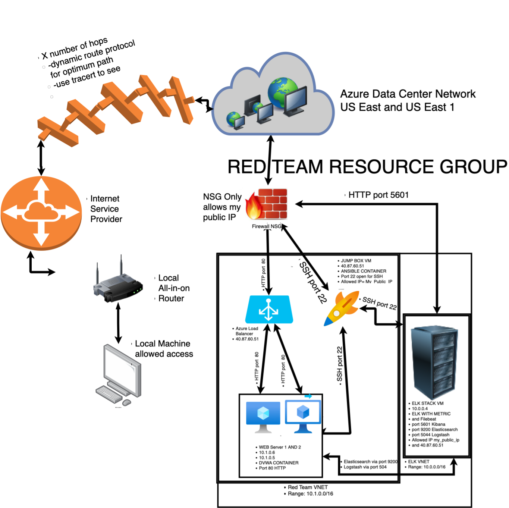

# Using Azure to Create an Instance of DVWA and ELK Stack
Azure network with DVWA and ELK stack for penetration testing



## Automated ELK Stack Deployment

The Files in this Repository were made to create a Live network hosting Damn Vulnerable Web App
and an ELK (ELastic search, Logstash, Kibana) stack monitoring for siumulated attacks.

[Install Elk Playbook](Playbooks/install-elk.yml)

This document contains the following details:
- Description of the Topology
- Access Policies
- ELK Configuration
  - Beats in Use
  - Machines Being Monitored
- How to Use the Ansible Build


### Description of the Topology
The main purpose of this network is to expose a load-balanced and monitored instance of DVWA, the D*mn Vulnerable Web Application. eb app allows a user to simulate an attack and provide incident mitigation. 

Load balancing ensures that the application will be highly available, in addition to restricting restricting traffic ito the network.
A load balancer helps maintain availability of resources by preventing web servers from being overloaded. Instead traffic goes through a Load Balancer and it evenly distributes requests to web servers.

Integrating an ELK server allows users to easily monitor the vulnerable VMs for changes to the data and system logs.
A FileBeat checks changes to specific Filles depending on User specification. Metricbeat helps Logs metrics from 
the machines operating systems. 

The configuration details of each machine may be found below.

| Name         | Function | IP Address | Operating System      |
|--------------|----------|------------|-----------------------|
| Jump Box     | Gateway  | 10.0.0.1   | Linux                 |
| Web-Server 1 | HTTP     | 10.1.0.5   | Docker DVWA Container |
| Web Server 2 | HTTP     | 10.1.0.6   | Docker DVWA Container |
| ELK Stack    | SIEM     | 10.0.0.4   | Kabana                |

### Access Policies

The machines on the internal network are not exposed to the public Internet. 

Only the ELK machine can accept connections from the Internet.
Access to this machine is only allowed from the following IP addresses:
My Public IPV4 

Machines within the network can only be accessed by my loacal machine.
    
 - ELK via Kabana through HTTP on port 5601
 - Jump Box vis SSH port 22
 - Load balancer on port 80

A summary of the access policies in place can be found in the table below.

| Name     | Publicly Accessible | Allowed IP Addresses   |
|----------|---------------------|------------------------|
| Jump Box | No                  | My_Public_IP           |
| Web 1    | No                  | 40.87.60.51, 10.1.0.4  |
| Web 2    | No                  | 40.87.60.51, 10.1.0.4  |
| ELK      | No                  | 10.1.0.4, My_Public_IP |

### Elk Configuration

Using ANsible I created a playbopok that allowed each container to be configured automatically. Nothing was configured manually... the playbook took the executed every command and configured our containers. This allows one easily buld new machines without the work of enetering each individual command. If an admistrator would like they can adjust the playbook for different preferences or needs. 


The playbook implements the following tasks:
- Installs Dockers
- Installs Python
- Downloads and launches an ELK container
- Enables starting docker upon system reboot

The following screenshot displays the result of running `docker ps` after successfully configuring the ELK instance.


### Target Machines & Beats
This ELK server is configured to monitor the following machines:
- 10.1.0.5
- 10.1.0.6

We have installed the following Beats on these machines:
- File Beat
- Metric Beat

These Beats allow us to collect the following information from each machine:
- File Beat
  - changes to logs and files
- Metric Beat
  - CPU usage, memory, file system, disk IO, and network IO statistics

### Using the Playbook
In order to use the playbook, you will need to have an Ansible control node already configured. Assuming you have such a control node provisioned: 

SSH into the control node and follow the steps below:
- Copy the filebeat_configuration.yml file to ELK VM.
- Update the hosts file to include the webservers local IP
- Run the playbook, and navigate to Kibana and check that Filebeat is recieving data


### Commands to download the playbook, update the files, and run The Filebeat playbook

#### Step 1: SSH into Jumpbox
```
$ ssh admin@jump-box-vm-ip
```

#### Step 2: Download Playbooks
```
# Filebeat config
$ cd /etc/ansible/files
$ curl https://gist.githubusercontent.com/slape/5cc350109583af6cbe577bbcc0710c93/raw/eca603b72586fbe148c11f9c87bf96a63cb25760/Filebeat > /etc/ansible/files/filebeat-config.yml
```
```
# Filebeat playbook
$ cd /etc/ansible/roles
$ curl filebeat playbook
```

 #### Step 3: Update Config File

Update filebeat-config.yml with ELK server local-ip on lines 1106 aand 1806 

#### Step 4: Run The Playbook
```
$ ansible-playbook filebeat_playbook.yml
```

